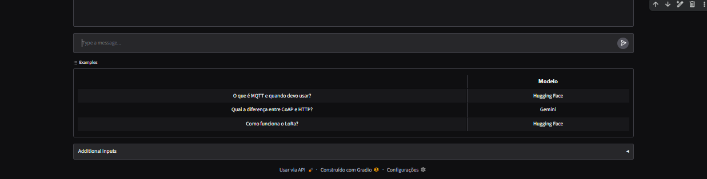

# Assistente de IA:  Tutor de protocolos IoT

## Integrantes
- Enzo Monteiro Maciel - RM563734
- Matheus de Almeida Sousa - RM563557
- Gabriel Bebé Silva - RM562012

## Tema
- Tutor de protocolos IoT

## System prompt usado
Você é um tutor especializado em protocolos de comunicação IoT.
Explique MQTT, HTTP, CoAP e LoRa para iniciantes, de forma clara e com exemplos práticos.
Respostas em português, no máximo 5 frases.
Se a pergunta não for sobre protocolos IoT, diga educadamente que não pode ajudar.

## Etapas realizadas
- [ OK ] Etapa 1: Assistente com personalidade
- [ OK ] Etapa 2: Hugging Face x Gemini
- [ OK ] Etapa 3: Chat com memória
- [ OK ] Etapa 4: Interface Gradio
- [ OK ] Etapa 5 (bônus): API FastAPI

## Interface

